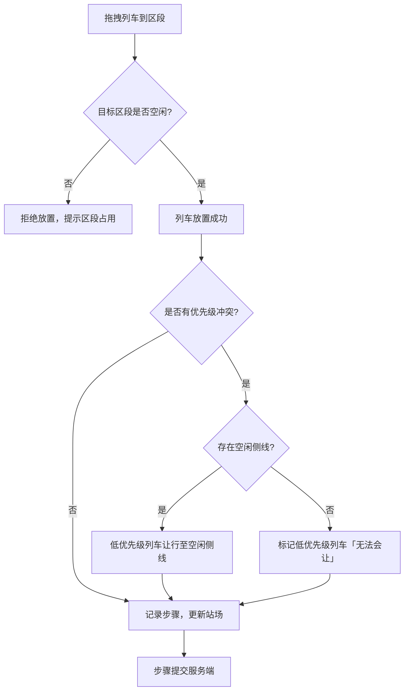
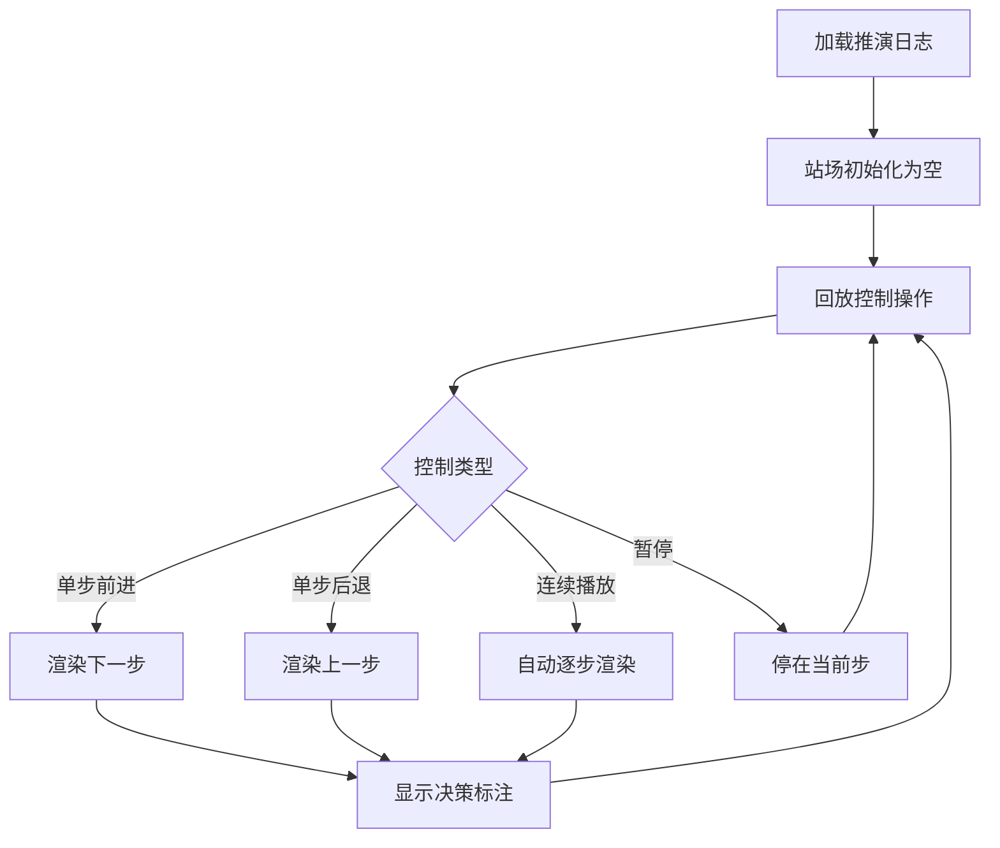

## 1. 产品概述
窄轨铁路会让站「侧线占用推演」沙盘系统，用于模拟列车在会让站的进出、会让与让行决策。站场含 1 条正线与 2 条侧线，操作人员可拖拽列车块进入线路区段，系统自动执行让行规则并记录每一步推演。支持按步骤回放推演全过程，辅助调度培训与决策验证。

## 2. 核心功能

### 2.1 用户角色
| 角色 | 注册方式 | 核心权限 |
|------|----------|----------|
| 调度员 | 无需注册，直接使用 | 执行推演、查看回放 |

### 2.2 功能模块
1. **推演沙盘页**：站场可视化、列车拖放、规则引擎实时判定、步骤提交
2. **回放页**：按步骤回放列车位置与让行决策，暂停/单步/连续播放控制

### 2.3 页面详情
| 页面名称 | 模块名称 | 功能描述 |
|----------|----------|----------|
| 推演沙盘页 | 站场图 | 可视化展示 1 正线 + 2 侧线，区段高亮占用状态 |
| 推演沙盘页 | 列车块面板 | 展示可拖拽列车块，每块标注长度与优先级 |
| 推演沙盘页 | 拖放交互 | 拖拽列车块进入线路区段，实时反馈占用/冲突 |
| 推演沙盘页 | 让行判定 | 低优先级列车自动让行至空闲侧线，侧线满时标记「无法会让」 |
| 推演沙盘页 | 步骤提交 | 每次操作提交服务端，记入步骤日志 |
| 推演沙盘页 | 推演状态栏 | 显示当前步骤数、各线路占用情况摘要 |
| 回放页 | 回放时间线 | 以时间线展示所有推演步骤 |
| 回放页 | 站场回放视图 | 复用站场图，按步骤渲染列车位置 |
| 回放页 | 回放控制 | 暂停、单步前进、单步后退、连续播放 |
| 回放页 | 决策标注 | 在每一步显示让行决策说明 |

## 3. 核心流程

### 3.1 推演流程
1. 调度员从列车块面板选取列车，拖入站场图某区段
2. 系统检查目标区段是否已被占用；若已占用则拒绝放置
3. 若目标区段空闲，列车放置成功；系统检查是否存在优先级冲突
4. 高优先级列车进入时，低优先级列车须让行：
   - 优先移入空闲侧线
   - 侧线已满则标记该列车为「无法会让」
5. 推演步骤提交服务端，包含：操作类型、列车信息、区段变化、让行决策
6. 重复步骤 1-5 直至推演完成

### 3.2 回放流程
1. 调度员进入回放页，加载某次推演的完整步骤日志
2. 站场图初始化为空，回放指针指向步骤 0
3. 调度员可单步前进/后退、连续播放、暂停
4. 每步显示列车位置变化与让行决策说明
5. 回放结束可返回推演沙盘页

## 4. 用户界面设计

### 4.1 设计风格
- **主色调**：深铁道灰 (#2D2D2D) + 信号红 (#E53935) + 安全绿 (#43A047)
- **辅助色**：侧线蓝 (#1565C0)、警告橙 (#FF8F00)、轨道棕 (#5D4037)
- **按钮风格**：圆角矩形，微阴影，交互时有缩放反馈
- **字体**：标题使用 Rajdhani（工业感），正文使用 Noto Sans SC
- **布局**：顶部状态栏 + 左侧列车面板 + 中央站场图 + 右侧日志面板
- **图标**：使用 lucide-react 图标库
- **氛围**：铁路调度室风格，暗色背景配信号灯色彩，工业仪表感

### 4.2 页面设计概览
| 页面名称 | 模块名称 | UI 元素 |
|----------|----------|----------|
| 推演沙盘页 | 站场图 | 水平轨道布局，正线居中粗线，侧线上下细线；区段高亮色表示占用状态；轨道枕木纹理背景 |
| 推演沙盘页 | 列车块面板 | 竖向卡片列表，每卡含列车编号、长度条形图、优先级星标；可拖拽 |
| 推演沙盘页 | 拖放交互 | 拖拽时半透明跟随，放置区段虚线框预览；冲突时红色闪烁提示 |
| 推演沙盘页 | 让行判定 | 让行列车滑动动画移入侧线；无法会让时红色徽章 + 震动动画 |
| 推演沙盘页 | 步骤提交 | 底部步骤计数器 + 操作确认按钮 |
| 推演沙盘页 | 推演状态栏 | 顶部深色条，显示步骤号、正线/侧线占用图标、推演会话编号 |
| 回放页 | 回放时间线 | 底部水平时间线条，步骤节点可点击跳转 |
| 回放页 | 站场回放视图 | 与推演页相同的站场图，列车位置随步骤变化 |
| 回放页 | 回放控制 | 底部控制栏：⏮ ⏪ ▶️ ⏩ ⏭，含播放速度调节 |
| 回放页 | 决策标注 | 站场图上方浮动气泡，显示当前步骤的让行决策文字说明 |

### 4.3 响应式设计
- 桌面优先设计，最小支持 1280px 宽度
- 站场图在窄屏下可横向滚动
- 回放控制栏固定在视口底部

### 4.4 动效设计
- 列车放置：弹性入场动画
- 让行移动：平滑滑动过渡
- 冲突提示：红色脉冲闪烁
- 步骤切换：淡入淡出过渡
- 回放播放：列车移动带轨迹残影效果
