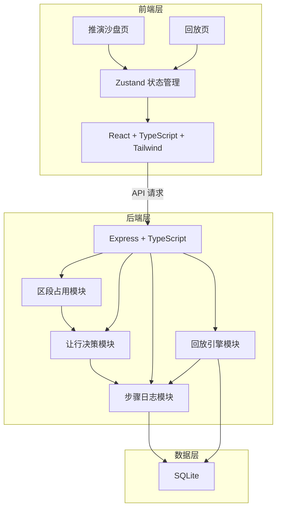
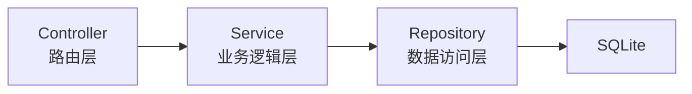
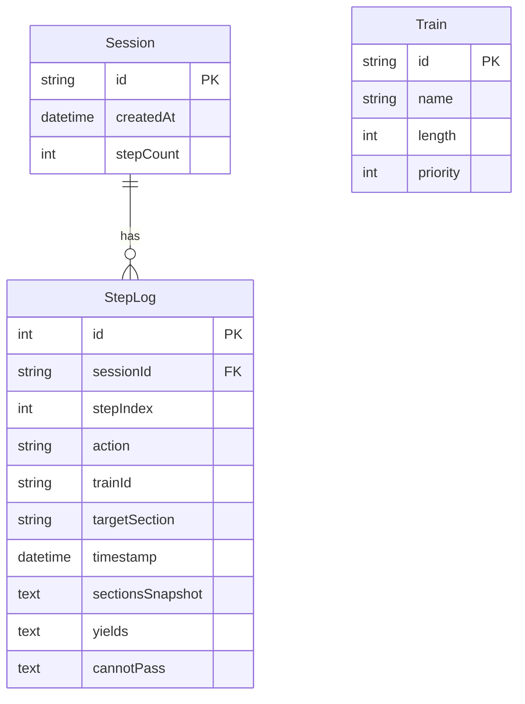

## 1. 架构设计



## 2. 技术说明
- **前端**：React@18 + TypeScript + Tailwind CSS@3 + Vite
- **初始化工具**：vite-init（react-express-ts 模板）
- **后端**：Express@4 + TypeScript（ESM 模式）
- **数据库**：SQLite（better-sqlite3，轻量文件数据库，适合 Docker 部署）
- **状态管理**：Zustand
- **拖拽库**：@dnd-kit/core + @dnd-kit/sortable
- **容器化**：Docker Compose（前端 + 后端 + SQLite 数据卷）

## 3. 路由定义
| 路由 | 用途 |
|------|------|
| / | 推演沙盘页：站场图、列车拖放、步骤提交 |
| /replay | 回放页：按步骤回放推演过程 |

## 4. API 定义

### 4.1 推演会话管理
```typescript
interface Session {
  id: string;
  createdAt: string;
  stepCount: number;
}

// POST /api/sessions
// 创建新推演会话
// Request: {}
// Response: { session: Session }

// GET /api/sessions/:id
// 获取推演会话信息
// Response: { session: Session }
```

### 4.2 推演步骤提交
```typescript
interface TrackSection {
  id: string;        // "main" | "siding-1" | "siding-2"
  name: string;      // "正线" | "侧线1" | "侧线2"
  occupiedBy: string | null;
}

interface Train {
  id: string;
  name: string;
  length: number;      // 列车长度（相对单位）
  priority: number;    // 优先级，数值越大优先级越高
}

interface YieldDecision {
  trainId: string;
  fromSection: string;
  toSection: string | null;   // null 表示无法会让
  reason: string;
}

interface StepSubmitRequest {
  sessionId: string;
  trainId: string;
  targetSection: string;
  action: "place" | "remove" | "yield";
}

interface StepSubmitResponse {
  stepIndex: number;
  sections: TrackSection[];
  yields: YieldDecision[];
  cannotPass: string[];     // 无法会让的列车ID列表
  success: boolean;
  message: string;
}
```

### 4.3 步骤日志查询
```typescript
interface StepLog {
  stepIndex: number;
  sessionId: string;
  action: string;
  trainId: string;
  targetSection: string;
  timestamp: string;
  sectionsSnapshot: TrackSection[];
  yields: YieldDecision[];
  cannotPass: string[];
}

// GET /api/sessions/:id/steps
// 获取推演会话所有步骤
// Response: { steps: StepLog[] }

// GET /api/sessions/:id/steps/:index
// 获取某一步骤详情
// Response: { step: StepLog }
```

### 4.4 回放接口
```typescript
interface ReplayState {
  stepIndex: number;
  totalSteps: number;
  sections: TrackSection[];
  yields: YieldDecision[];
  cannotPass: string[];
  decisionDescription: string;
}

// GET /api/sessions/:id/replay
// 获取完整回放数据
// Response: { states: ReplayState[], session: Session }
```

## 5. 服务端架构图



### 5.1 模块职责
- **区段占用模块 (SectionOccupationService)**：管理正线与侧线的占用状态，判定区段是否空闲，执行列车的放置与移除
- **让行决策模块 (YieldDecisionService)**：根据优先级规则判定让行，计算低优先级列车应移入的侧线，侧线满时标记「无法会让」
- **步骤日志模块 (StepLogService)**：记录每次推演操作的完整快照，包括区段状态、让行决策、时间戳
- **回放引擎模块 (ReplayEngineService)**：按步骤索引查询快照，生成回放状态序列

## 6. 数据模型

### 6.1 数据模型定义



### 6.2 数据定义语言
```sql
CREATE TABLE sessions (
  id TEXT PRIMARY KEY,
  createdAt TEXT NOT NULL,
  stepCount INTEGER NOT NULL DEFAULT 0
);

CREATE TABLE step_logs (
  id INTEGER PRIMARY KEY AUTOINCREMENT,
  sessionId TEXT NOT NULL REFERENCES sessions(id),
  stepIndex INTEGER NOT NULL,
  action TEXT NOT NULL,
  trainId TEXT NOT NULL,
  targetSection TEXT NOT NULL,
  timestamp TEXT NOT NULL,
  sectionsSnapshot TEXT NOT NULL,
  yields TEXT NOT NULL DEFAULT '[]',
  cannotPass TEXT NOT NULL DEFAULT '[]'
);

CREATE TABLE trains (
  id TEXT PRIMARY KEY,
  name TEXT NOT NULL,
  length INTEGER NOT NULL,
  priority INTEGER NOT NULL
);

CREATE INDEX idx_step_logs_session ON step_logs(sessionId, stepIndex);

INSERT INTO trains (id, name, length, priority) VALUES
  ('train-1', '列车 A', 3, 5),
  ('train-2', '列车 B', 2, 3),
  ('train-3', '列车 C', 4, 1),
  ('train-4', '列车 D', 2, 4),
  ('train-5', '列车 E', 3, 2);
```
